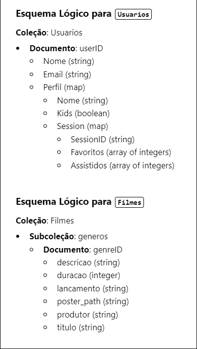

# Arquitetura da solução

## Diagrama de classes

##  Modelo de dados

### Modelo ER

### Esquema lógico

### Modelo físico

## Tecnologias

Descreva qual(is) tecnologias você vai usar para resolver o seu problema, ou seja, implementar a sua solução. Liste todas as tecnologias envolvidas, linguagens a serem utilizadas, serviços web, frameworks, bibliotecas, IDEs de desenvolvimento, e ferramentas.

Apresente também uma figura explicando como as tecnologias estão relacionadas ou como uma interação do usuário com o sistema vai ser conduzida, por onde ela passa até retornar uma resposta ao usuário.

| **Dimensão**   | **Tecnologia**  |
| ---            | ---             |
| Front-end      | HTML + CSS + JS + React + Tailwind + Sass |
| Back-end       | Node.js + Firebase |
| APIs | TheMovieDB |
| IDE | Visual Studio Code|
| Prototipagem | Figma |
| Versionamento | Git |
| SGBD           | Firestore |
| Deploy         | Vercel |

## Hospedagem

Explique como a hospedagem e o lançamento da plataforma foram realizados.

> **Links úteis**:
> - [Website com GitHub Pages](https://pages.github.com/)
> - [Programação colaborativa com Repl.it](https://repl.it/)
> - [Getting started with Heroku](https://devcenter.heroku.com/start)
> - [Publicando seu site no Heroku](http://pythonclub.com.br/publicando-seu-hello-world-no-heroku.html)

## Qualidade de software

Ao selecionar as características e subcaracterísticas adequadas, a PucFlix focar os esforços em um produto que atenda às necessidades dos usuários. Essas subcaracterísticas estão destacadas na tabela abaixo: 

| **Característica**   | **Subcaracterística**  | **Justificativa**  |  
| ---            | ---             |  ---             |
| Funcionalidade | Adequação |Assegura que todas as funcionalidades — como a filtragem de gêneros e a adição a favoritos — sejam implementadas para atender às necessidades reais dos usuários.  |
| Usabilidade | Compreensibilidade |A interface do usuário deve ser intuitiva e fácil de entender, permitindo que os usuários naveguem pela plataforma com facilidade.|
| Usabilidade | Aprendibilidade |O sistema deve ser simples de aprender, para que novos usuários consigam utilizar a plataforma rapidamente e sem dificuldades. |
| Confiabilidade | Maturidade|Apresentar um número mínimo de falhas e erros, aumentando a confiança dos usuários na plataforma. |
| Confiabilidade | Capacidade de Recuperação |Em caso de falhas, o sistema deve ser capaz de se recuperar rapidamente, minimizando o impacto negativo na experiência do usuário.|
| Segurança | Confidencialidade |A proteção dos dados dos usuários é essencial, garantindo que as informações pessoais sejam mantidas em segurança durante o uso da plataforma.|
| Segurança| Integridade |Os dados do usuário devem permanecer intactos e não sofrer alterações não autorizadas, o que é crucial para a confiança na plataforma.|
| Portabilidade| Adaptabilidade |A plataforma deve funcionar bem em diferentes dispositivos (computadores, tablets e smartphones), garantindo uma experiência de uso flexível.|

> **Links úteis**:
> - [ISO/IEC 25010:2011 - Systems and Software Engineering — Systems and Software Quality Requirements and Evaluation (SQuaRE) — System and Software Quality Models](https://www.iso.org/standard/35733.html/)
> - [Análise sobre a ISO 9126 – NBR 13596](https://www.tiespecialistas.com.br/analise-sobre-iso-9126-nbr-13596/)
> - [Qualidade de software - Engenharia de Software](https://www.devmedia.com.br/qualidade-de-software-engenharia-de-software-29/18209)
